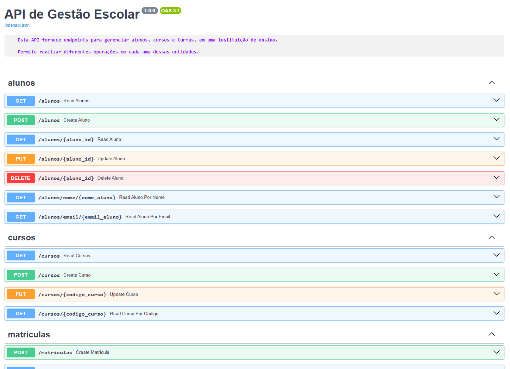

<p align="center">
    
</p>

# Imersão Cloud DevOps - Alura/Google

> ℹ️ **NOTE:** Este é um repositório desenvolvido durante os meus estudos da Imersão Cloud DevOps da [Alura](https://www.alura.com.br/) em parceria com o [Google](https://www.google.com/).

## ✨ Features
✅ Bem vindos! Este é um projeto com o objetivo de criar uma API desenvolvida com FastAPI para gerenciar alunos, cursos e matrículas em uma instituição de ensino. Minha gratidão a Deus, Alura e Google pela oportunidade.

✅ Welcome! This is a project aimed at creating an API developed with FastAPI to manage students, courses, and enrollments at an educational institution. I am grateful to God, Alura, and Google for this opportunity.

## 💻 Tecnologias utilizadas no projeto

- [Python 3.10 ou superior instalado](https://www.python.org/downloads/)
- [Git](https://git-scm.com/downloads)
- [Docker](https://www.docker.com/get-started/)

## Passo a passo para subir o projeto

### 1. **Fazer o download do repositório:**

👉 [Clique aqui para realizar o download](https://github.com/guilhermeonrails/imersao-devops/archive/refs/heads/main.zip)

Ou, se preferir, clone o projeto inicial via Git:

```
git clone https://github.com/guilhermeonrails/ellis
```

### 2. **Criar um ambiente virtual:**

No terminal Windows (cmd ou PowerShell), execute:
```sh
python -m venv ./venv
```

opcional, no terminal Windows:
```sh
py -m venv ./venv
```

No terminal Linux (bash ou WSL), execute:
```sh
python3 -m venv ./venv
```

### 3. **Ativar o ambiente virtual:**

   - No Linux/Mac:
      ```sh
      source venv/bin/activate
      ```
   - No Windows (cmd ou PowerShell), se exigir permissões, abra um terminal no modo administrador e execute o comando:
   ```sh
   Set-ExecutionPolicy RemoteSigned
   ```

     ```sh
     venv\Scripts\activate
     ```
   - Caso não funcione o comando acima, tente no Windows com bash (Git Bash ou WSL):   
     ```sh
      source venv\Scripts\activate
     ```

   ⚠️ *Certifique-se de ativar o ambiente virtual antes de instalar as dependências.*

### 4. **Instalar as dependências:**

   ```sh
   pip install -r requirements.txt
   ```

### 5. **Executar a aplicação localmente:**

   ```sh
   uvicorn app:app --reload
   ```

### 6. **Acessar a documentação interativa:**

   Abra o navegador e acesse:  
   [http://127.0.0.1:8000/docs](http://127.0.0.1:8000/docs)

   *Obs: Essa é a documentação interativa gerada pelo FastAPI. Você pode testar todos os endpoints diretamente por ela.*

### 7. **Criar e configurar o arquivo Dockerfile:**

   Acessar o dockerhub para pegar a tag da imagem e colocar no Dockerfile:
   - [Dockerhub](https://hub.docker.com/)

   *Obs: ver configurações no arquivo "Dockerfile" deste projeto ou consulte a documentação oficial se necessário.*

### 8. **Criar o arquivo .dockerignore:**

   Adicionar as seguintes pastas/arquivos para evitar que sejam copiadas para a imagem:

   ```
   venv
   __pycache__
   *.pyc
   *.pyo
   *.pyd
   .Python
   .env
   ```

   *Obs: Isso ajuda a manter a imagem mais leve e segura. Ver configurações no arquivo ".dockerignore" deste projeto ou consulte a documentação oficial se necessário.*

### 9. **Criar a imagem Docker:**

   ```
   docker build -t sua-imagem .
   ```
   📌 *Obs: O "-t" define a tag (nome) da imagem. Use letras minúsculas e sem espaços. O "." indica o diretório atual (onde está o Dockerfile)*

### 10. **Conferir a imagem usando o seguinte comando:**

   ```
   docker images
   ```

### 11. **Rodar a imagem usando o seguinte comando:**

   ```
   docker run -p 8000:8000 sou-imagem
   ```
   🔄 *Obs: Isso mapeia a porta do container (8000) para a porta local (8000).* 
   
   Acesse no navegador, caso um não funcione, tente o próximo link:
   - http://0.0.0.0:8000/docs
   - https://0.0.0.0:8000/docs
   - localhost:8000/docs
   - 127.0.0.1:8000/docs

### 12. **Criar e configurar o arquivo docker-compose.yml:**

   *Obs: Certifique-se de manter a indentação correta (espaços, não tabulação). Ver configurações no arquivo "docker-compose.yml" deste projeto ou consulte a documentação oficial se necessário.*

### 13. **Subir a aplicação com docker-compose:**
   ```
   docker-compose up
   ```

   *Obs: Isso irá construir a imagem e iniciar o container de forma automática.*

---

## Estrutura do Projeto

- `app.py`: Arquivo principal da aplicação FastAPI.
- `models.py`: Modelos do banco de dados (SQLAlchemy).
- `schemas.py`: Schemas de validação (Pydantic).
- `database.py`: Configuração do banco de dados SQLite.
- `routers/`: Diretório com os arquivos de rotas (alunos, cursos, matrículas).
- `requirements.txt`: Lista de dependências do projeto.

---

- O banco de dados SQLite será criado automaticamente como `escola.db` na primeira execução.
- Para reiniciar o banco, basta apagar o arquivo `escola.db` (isso apagará todos os dados).

---

##  AWS Certified Cloud Practitioner, AWS Cloud Computing and Front-End Student 
<br>
<p>
    
    <p>&nbsp&nbsp&nbspVictor Cardoso<br>
    &nbsp&nbsp&nbsp
    <a 
        href="https://github.com/VictorSamuraiWol">
        GitHub
    </a>
    &nbsp;|&nbsp;
    <a 
        href="https://www.linkedin.com/in/victor-cardoso-cloud-front/">
        LinkedIn
    </a>
    &nbsp;|&nbsp;
    </p>
</p>
<br/>

---

⌨️ com 💚 por [Victor Cardoso](https://github.com/VictorSamuraiWol)
